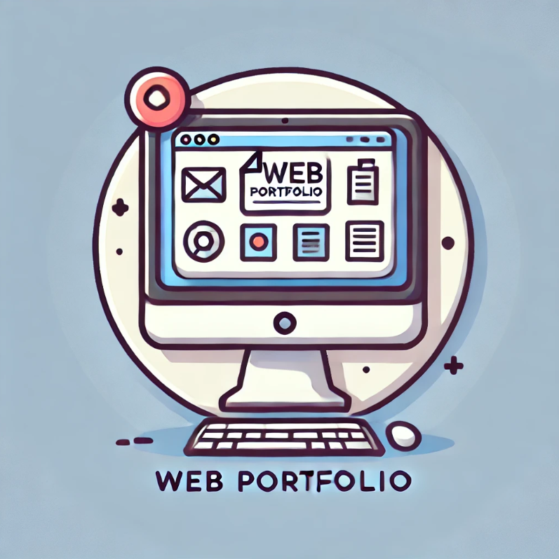
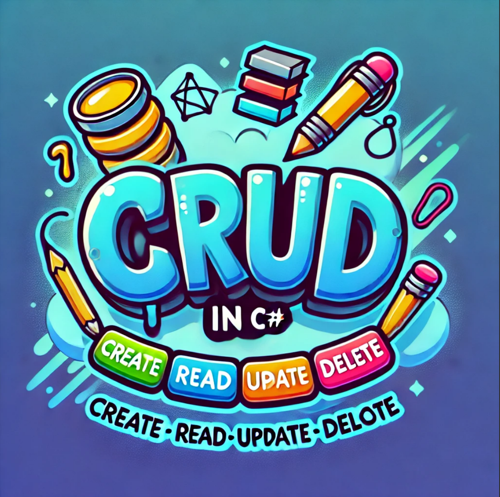

<!-- Main Title -->
# DeanDev

<!-- About Me -->
👋 Hi! I'm Dean, a passionate full-stack developer with a strong focus on building efficient and user-friendly web applications. I believe in continuous learning and staying up-to-date with the latest technologies to deliver top-quality solutions. My goal is to create impactful software that solves real-world problems while also being enjoyable to use. Here are some of the technologies I work with:

## Technologies
### Frontend

### Backend

### Databases

## Projects

<table>
  <tr>
    <td>
      
    </td>
    <td>
      <h3>Portfolio</h3>
      
My personal portfolio where I showcase my projects and skills.

      <strong>Technologies:</strong> 
       
      <a href="https:https://github.com/dmod73">View project</a>
    </td>
  </tr>
  <tr>
    <td>
      
    </td>
    <td>
      <h3>Currency Converter</h3>
      
A currency converter that uses APIs to fetch exchange rates.

      <strong>Technologies:</strong> 
       
       
      <a href="https://github.com/dmod73">View project</a>
    </td>
  </tr>
  <tr>
    <td>
      
    </td>
    <td>
      <h3>CRUD</h3>
      
A general CRUD application created to practice CRUD concepts.

      <strong>Technologies:</strong> 
       
      <a href="https://github.com/dmod73">View project</a>
    </td>
  </tr>
</table>

## Connect with me:

